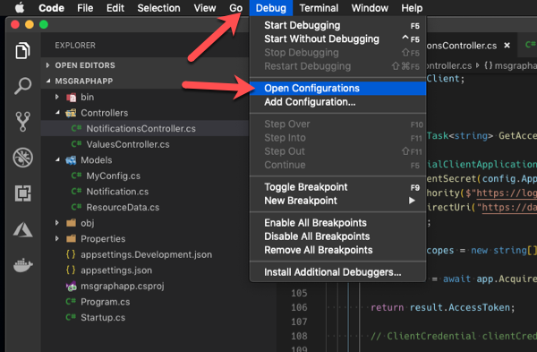
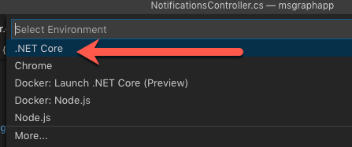
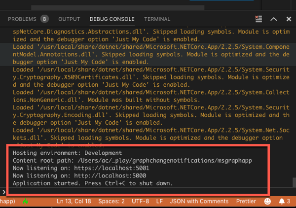
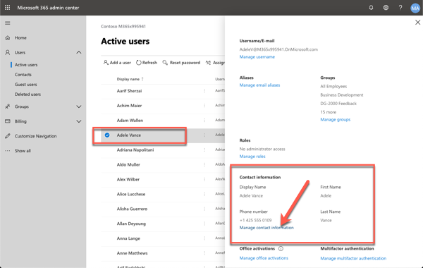

<!-- markdownlint-disable MD002 MD041 -->

<span data-ttu-id="47812-101">Visual Studio Code でアプリケーションをデバッグするための起動構成を作成します。</span><span class="sxs-lookup"><span data-stu-id="47812-101">Create a launch configuration to debug the application in Visual Studio Code.</span></span>

<span data-ttu-id="47812-102">Visual Studio Code 内で、[**デバッグ > 開く構成**] を選択します。</span><span class="sxs-lookup"><span data-stu-id="47812-102">Within Visual Studio Code, select **Debug > Open Configurations**.</span></span>

  

<span data-ttu-id="47812-104">環境の選択を求めるメッセージが表示されたら、[ **.Net Core**] を選択します。</span><span class="sxs-lookup"><span data-stu-id="47812-104">When prompted to select an environment, select **.NET Core**.</span></span>

  

> [!NOTE]
> <span data-ttu-id="47812-106">既定では、.NET コア起動構成はブラウザーを開き、デバッガーを起動するときにアプリケーションの既定の URL に移動します。</span><span class="sxs-lookup"><span data-stu-id="47812-106">By default, the .NET Core launch configuration will open a browser and navigate to the default URL for the application when launching the debugger.</span></span> <span data-ttu-id="47812-107">このアプリケーションでは、代わりに NGrok URL に移動します。</span><span class="sxs-lookup"><span data-stu-id="47812-107">For this application, we instead want to navigate to the NGrok URL.</span></span> <span data-ttu-id="47812-108">起動構成をそのままにしておくと、アプリケーションをデバッグするたびに、破損したページが表示されます。</span><span class="sxs-lookup"><span data-stu-id="47812-108">If you leave the launch configuration as is, each time you debug the application it will display a broken page.</span></span> <span data-ttu-id="47812-109">URL のみを変更するか、起動構成を変更してブラウザーを起動しないようにすることができます。</span><span class="sxs-lookup"><span data-stu-id="47812-109">You can just change the URL, or change the launch configuration to not launch the browser:</span></span>

<span data-ttu-id="47812-110">Visual Studio デバッガーの起動構成を更新します。</span><span class="sxs-lookup"><span data-stu-id="47812-110">Update the Visual Studio debugger launch configuration:</span></span>

  1. <span data-ttu-id="47812-111">Visual Studio Code で、ファイル **. vscode/launch**を開きます。</span><span class="sxs-lookup"><span data-stu-id="47812-111">In Visual Studio Code, open the file **.vscode/launch.json**.</span></span>
  1. <span data-ttu-id="47812-112">既定の構成で、次のセクションを見つけます。</span><span class="sxs-lookup"><span data-stu-id="47812-112">Locate the following section in the default configuration:</span></span>

      ```json
      "launchBrowser": {
        "enabled": true
      },
      ```

  1. <span data-ttu-id="47812-113">`enabled`プロパティをに`false`設定します。</span><span class="sxs-lookup"><span data-stu-id="47812-113">Set the `enabled` property to `false`.</span></span>
  1. <span data-ttu-id="47812-114">変更内容を保存します。</span><span class="sxs-lookup"><span data-stu-id="47812-114">Save your changes.</span></span>

### <a name="test-the-application"></a><span data-ttu-id="47812-115">アプリケーションをテストします。</span><span class="sxs-lookup"><span data-stu-id="47812-115">Test the application:</span></span>

<span data-ttu-id="47812-116">Visual Studio Code で、[デバッグ **> デバッグ開始**] を選択して、アプリケーションを実行します。</span><span class="sxs-lookup"><span data-stu-id="47812-116">In Visual Studio Code, select **Debug > Start debugging** to run the application.</span></span> <span data-ttu-id="47812-117">VS コードによって、アプリケーションが構築され、星形になります。</span><span class="sxs-lookup"><span data-stu-id="47812-117">VS Code will build and star the application.</span></span>

<span data-ttu-id="47812-118">**デバッグコンソール**ウィンドウに次のように表示されます。</span><span class="sxs-lookup"><span data-stu-id="47812-118">Once you see the following in the **Debug Console** window...</span></span>



<span data-ttu-id="47812-120">...ブラウザーを開き、に**http://localhost:5000/api/notifications**移動して、変更通知を購読します。</span><span class="sxs-lookup"><span data-stu-id="47812-120">... open a browser and navigate to **http://localhost:5000/api/notifications** to subscribe to change notifications.</span></span> <span data-ttu-id="47812-121">成功した場合は、次のようなサブスクリプション id を含む出力が表示されます。</span><span class="sxs-lookup"><span data-stu-id="47812-121">If successful you will see output that includes a subscription id like the one below:</span></span>


<span data-ttu-id="47812-123">アプリケーションは、Office 365 テナントのユーザーに更新が行われたときに Microsoft Graph から通知を受信するようにサブスクライブされました。</span><span class="sxs-lookup"><span data-stu-id="47812-123">Your application is now subscribed to receive notifications from the Microsoft Graph when an update is made on any users in the Office 365 tenant.</span></span>

<span data-ttu-id="47812-124">通知をトリガーします。</span><span class="sxs-lookup"><span data-stu-id="47812-124">Trigger a notification:</span></span>

1. <span data-ttu-id="47812-125">ブラウザーを開き、 [Microsoft 365 管理センター (https://admin.microsoft.com/AdminPortal)](https://admin.microsoft.com/AdminPortal)) に移動します。</span><span class="sxs-lookup"><span data-stu-id="47812-125">Open a browser and navigate to the [Microsoft 365 admin center (https://admin.microsoft.com/AdminPortal)](https://admin.microsoft.com/AdminPortal).</span></span>
1. <span data-ttu-id="47812-126">ログインするように求められた場合は、管理者アカウントを使用してサインインします。</span><span class="sxs-lookup"><span data-stu-id="47812-126">If prompted to login, sign-in using an admin account.</span></span>
1. <span data-ttu-id="47812-127">[**ユーザー > アクティブユーザー**] を選択します。</span><span class="sxs-lookup"><span data-stu-id="47812-127">Select **Users > Active users**.</span></span>

    

1. <span data-ttu-id="47812-129">アクティブなユーザーを選択し、**連絡先情報**として [**編集**] を選択します。</span><span class="sxs-lookup"><span data-stu-id="47812-129">Select an active user and select **Edit** for their **Contact information**.</span></span>

    

1. <span data-ttu-id="47812-131">**電話番号**の値を新しい番号で更新し、[**保存**] を選択します。</span><span class="sxs-lookup"><span data-stu-id="47812-131">Update the **Phone number** value with a new number and Select **Save**.</span></span>

    <span data-ttu-id="47812-132">Visual Studio Code**デバッグコンソール**に、通知が受信されたことが表示されます。</span><span class="sxs-lookup"><span data-stu-id="47812-132">In the Visual Studio Code **Debug Console**, you will see a notification has been received.</span></span> <span data-ttu-id="47812-133">場合によっては、到着までに数分かかる場合があります。</span><span class="sxs-lookup"><span data-stu-id="47812-133">Sometimes this may take a few minutes to arrive.</span></span> <span data-ttu-id="47812-134">出力の例を次に示します。</span><span class="sxs-lookup"><span data-stu-id="47812-134">An example of the output is below:</span></span>

    ```shell
    Received notification: 'Users/7a7fded6-0269-42c2-a0be-512d58da4463', 7a7fded6-0269-42c2-a0be-512d58da4463
    ```

<span data-ttu-id="47812-135">これは、アプリケーションが、出力で指定されたユーザーの Microsoft Graph から通知を正常に受信したことを示します。</span><span class="sxs-lookup"><span data-stu-id="47812-135">This indicates the application successfully received the notification from the Microsoft Graph for the user specified in the output.</span></span> <span data-ttu-id="47812-136">その後、この情報を使用して、ユーザーの詳細をアプリケーションに同期する場合に、Microsoft Graph についての詳細情報を検索することができます。</span><span class="sxs-lookup"><span data-stu-id="47812-136">You can then use this information to query the Microsoft Graph for the users full details if you want to synchronize their details into your application.</span></span>